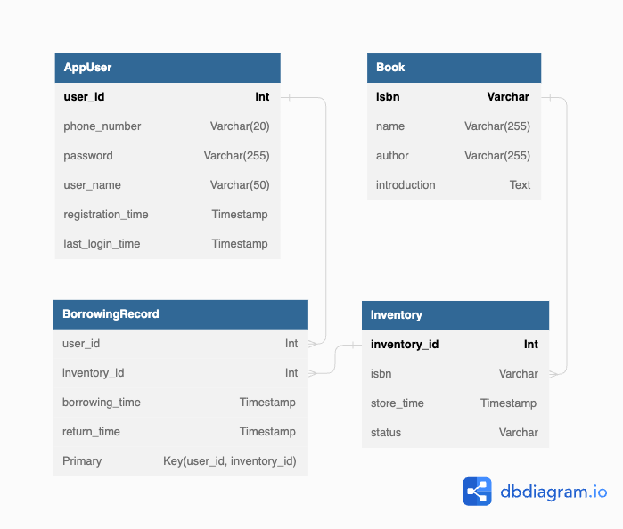

# Full Stack Book Rental System (In Progress)

A full stack book rental system built using Spring Boot, Vue.js, and PostgreSQL.

## Table of Contents

- [Technologies](#technologies)
- [Database Schema](#database-schema)
- [Getting Started](#getting-started)
  - [Bootstrap the database with Docker](#bootstrap-the-database-with-docker)
  - [Remove the database from Docker](#remove-the-database-from-docker)
- [Backend Development](#backend-development)
  - [Current State](#current-state)
- [Frontend Development](#frontend-development)
  - [Current State](#current-state-1)

## Technologies

### Backend
- Spring Boot 3
- Spring Security
- JWT

### Frontend
- Vue.js
- Vite

## Database Schema



## Getting Started
### Steps
1. Setup psql with Docker
2. Run backend: BookLendingSystemApplication
3. Run frontend

### Bootstrap the database with Docker
```
make db-up
```

### Remove the database from Docker
```
make db-down
```

## Backend Development
### Current State
- User registration
  - via `POST` request to `localhost:8080/api/users`
  - password is hashed
- User authentication with JWT token
- Login
  - via `POST` request to `localhost:8080/api/auth/login`
  - Checks username (phone_number) and password
- Fake Data
  - fake user, book, and inventory data will be generated everytime the application runs 
- Entry point of the backend
  - `book-lending-system/backend/src/main/java/com/leehaowei/booklendingsystem/BookLendingSystemApplication`

## Frontend Development
### Current State
- Log-in and register page
  - User will need to log in after successful registered
  - User will have access to the book list once log in successfully
- Run the frontend (make sure backend and database on Docker are running)
```
cd frontend/vue
npm run dev
```

## Example
- Register Info
  - Phone Number: 0800076666
  - password: password
  - User Name: pizza
- Log in Info
  - Phone Number: 0800076666
  - password: password

## Note
1. User table is adjusted to the name app_user to avoid reserved word "user" in psql
2. Due to time constraints and being new to Spring Security, the project is still in progress.
- Completed
  - User registration
  - User log in validation
  - Essential JPA Mapping to RDBMS
- In Progress
  - Book rental transaction
    - Create new record based on transaction
    - Update inventory stats based on transaction
    - Align inventory, book, and borrowing record data
  - User details
    - check duplication
    - registration and last login time
  - Tests